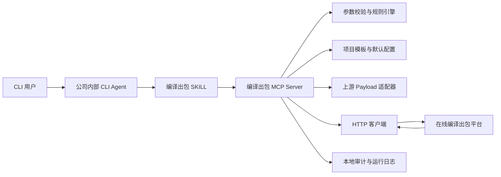
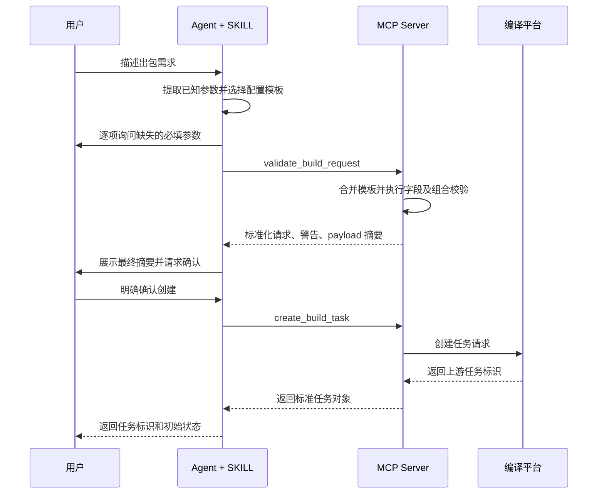
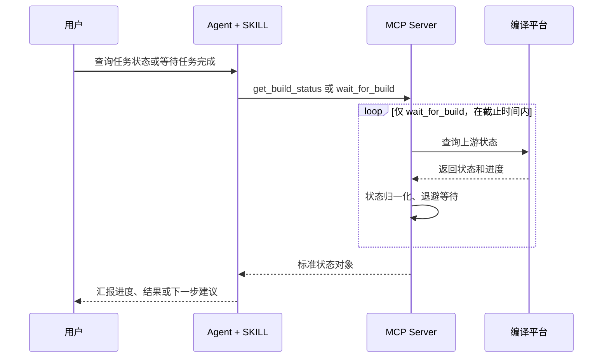

# 在线编译出包 Agent：MCP 与 SKILL 方案设计

## 1. 文档概述

### 1.1 背景

公司已有一个在线编译出包平台。用户在网站上选择或填写代码库、代码分支、配套组件、点分号、集成分支、集成节点和出包描述等信息，然后发起编译任务。创建接口返回一个任务标识，另一个接口可根据该标识查询编译进度。

现在希望把该能力接入公司内部的 CLI Agent，使用户可以通过自然语言完成参数收集、提交确认、任务创建和进度查询。

### 1.2 已知条件

当前已确认的约束如下：

1. 公司内部 CLI Agent 同时支持 MCP 和 SKILL。
2. 编译平台目前提供创建任务接口和查询任务进度接口。
3. 接口方说明当前接口不需要鉴权。
4. 平台没有提供代码库、分支、组件、点分号、集成节点等候选项的查询接口。
5. 当前已有一份创建任务的示例 payload，但字段的完整枚举、依赖关系、默认值和部分字段语义仍需通过接口联调确认。
6. 本文不假设可以修改现有编译平台，因此核心方案应能在只使用现有两个接口的情况下落地。

### 1.3 设计目标

本方案需要实现以下目标：

- 用户可以用自然语言描述一次编译出包需求。
- Agent 能识别已提供参数，并逐项补齐缺失的必填参数。
- 在真正创建任务前，系统必须展示最终参数摘要并获得用户明确确认。
- MCP 以结构化方式调用创建接口，并返回稳定、可解释的任务结果。
- 用户可以查询任务进度，也可以选择等待到成功、失败或超时。
- 原始网站 payload、默认值、固定值和字段类型转换由程序控制，不依赖模型自由拼接。
- 能处理接口超时、重复提交、状态未知、返回结构变化等工程问题。
- 后续可以扩展任务取消、日志查看、产物地址获取、配置模板管理等能力。

### 1.4 非目标

第一阶段不建议承担以下工作：

- 模拟浏览器点击网页。
- 自动从 Git 服务发现所有仓库和分支。
- 自动判断任意仓库、分支和组件组合一定能够成功编译。
- 在编译平台没有能力支持时实现真正的服务端任务取消。
- 绕过公司网络、安全审计或权限控制。
- 让模型直接生成并提交未经程序校验的完整上游 payload。

---

## 2. 核心难点与设计原则

### 2.1 参数无法在线发现

平台没有候选项查询接口，因此 Agent 无法验证某个仓库、分支、组件或集成节点是否真实存在。可行的参数来源只有：

- 用户显式输入。
- 团队维护的本地配置模板。
- CLI Agent 提供的可信运行环境信息。
- 用户此前成功任务形成的受控预设；该能力建议在第二阶段实现。

因此，系统必须明确区分两类校验：

- 本地确定性校验：必填字段、类型、格式、枚举、字段依赖和禁止组合。
- 上游真实性校验：仓库、分支或节点是否存在，只能在创建任务后由上游接口接受或拒绝。

Agent 不应把“本地格式校验通过”表述为“参数在编译平台上一定有效”。

### 2.2 示例 payload 不是稳定契约

示例 payload 只能证明某一种组合曾被接口接受，不能证明：

- 所有字段都是必填字段。
- 示例中的值适用于其他项目。
- 字符串 `"false"` 可以替换为 JSON 布尔值 `false`。
- 字段名中的拼写错误可以修正。
- `point` 中重复的版本字段可以省略。
- 创建成功一定使用 HTTP 2xx，或任务标识一定处于某个固定字段。

所以应先建立“Agent 业务模型”，再由一个独立适配器生成网站 payload。上游字段的奇怪拼写和类型在适配器中原样保留，避免污染 Agent 的公共工具契约。

### 2.3 创建任务是有副作用操作

创建任务可能消耗编译资源、占用队列、生成版本或触发后续交付，因此不能像普通查询一样自动执行。推荐强制执行：

1. 收集参数。
2. 本地校验。
3. 展示标准化摘要。
4. 用户明确确认。
5. 创建任务。

“帮我看看这个配置是否能出包”不等于“立即出包”。只有用户表达明确提交意图，或在摘要后回答确认，才能调用创建工具。

### 2.4 无鉴权不代表无安全边界

接口不需要鉴权意味着任何能访问接口的人或程序都可能创建任务。即使不修改上游平台，MCP 侧仍应采用以下控制：

- MCP Server 只允许访问固定配置的编译平台地址，禁止模型传入任意 URL。
- 仅在公司内网或受控执行环境部署。
- 创建操作要求明确确认。
- `trigger` 由可信上下文注入，不接受模型随意指定。
- 对调用者、参数摘要、任务标识、时间和结果进行审计记录。
- 限制单用户或单进程的创建频率。
- 对短时间内相同请求进行重复提交检测。

长期建议推动编译平台增加服务身份和调用者身份校验，因为 MCP 侧审计无法替代上游鉴权。

---

## 3. 可执行方案对比

### 3.1 方案一：纯 SKILL

#### 方案说明

SKILL 描述完整工作流，并调用一个本地 Python 或 Node.js 脚本。脚本接收 JSON 参数，调用创建或查询接口，再把结果打印给 Agent。

#### 实施路线

1. 编写一个 API 客户端脚本，包含 `create` 和 `status` 两个命令。
2. 在脚本中完成 payload 映射、超时处理和基础错误解析。
3. 编写 SKILL，规定收集参数、展示摘要、确认后创建、创建后查询的步骤。
4. 将项目常用参数写入只读配置文件。
5. 用几个典型项目完成端到端联调。

#### 优点

- 开发周期最短，适合快速 PoC。
- 部署简单，不需要单独注册完整 MCP 工具集。
- 对话流程集中在 SKILL 中，便于快速调整。
- 对少量用户和少量项目足够实用。

#### 缺点

- 脚本输入输出通常不如 MCP Schema 严格。
- 能力难以被其他 Agent 或客户端标准化复用。
- 长轮询、进度更新、重试和错误分类容易逐渐堆积在单一脚本中。
- 模型与脚本之间的调用约定较脆弱。
- 后续扩展会逐渐演化成一个非标准的工具协议。

#### 适用场景

- 需要在很短时间内证明自然语言出包可行。
- 使用者很少，暂时不要求平台化复用。
- 团队尚未形成 MCP 的部署和维护机制。

#### 建议定位

可作为一周左右的验证版本，但不建议作为长期生产架构。

### 3.2 方案二：纯 MCP Server

#### 方案说明

将编译平台能力封装为一组结构化 MCP 工具。Agent 根据工具描述自行收集参数并调用工具。

#### 实施路线

1. 定义业务请求 Schema 和返回 Schema。
2. 实现参数校验器和上游 payload 适配器。
3. 实现创建任务、查询状态和等待任务工具。
4. 注册到公司 CLI Agent。
5. 通过工具描述告知 Agent 调用前置条件。

#### 优点

- 工具契约清晰，参数和返回值结构稳定。
- 可以被多个 Agent、IDE 或自动化流程复用。
- 校验、重试、限流、日志和适配逻辑集中维护。
- 适合异步任务和状态轮询。
- 后续增加工具不会破坏既有调用方式。

#### 缺点

- MCP 擅长提供能力，但不天然保证完整业务流程。
- 仅靠工具说明，Agent 仍可能在未展示摘要时尝试创建任务。
- 用户如何补齐参数、如何选择模板、何时确认等交互规则不够集中。
- 不同 Agent 的实际交互表现可能不一致。

#### 适用场景

- 主要目标是向多个客户端提供统一编译工具。
- 用户已经习惯结构化命令，交互流程要求不高。
- CLI Agent 本身有强制的工具确认或审批机制。

#### 建议定位

比纯 SKILL 更适合长期维护，但用户体验和防误操作仍需要 Agent 侧规则补强。

### 3.3 方案三：MCP + SKILL 组合

#### 方案说明

MCP Server 负责稳定、可测试的执行能力；SKILL 负责自然语言理解、参数补齐、提交确认和状态解释。

#### 实施路线

1. 先实现 MCP 的参数校验、创建任务和查询状态三个核心工具。
2. 在 MCP 内部实现业务模型到上游 payload 的单向映射。
3. 建立项目模板配置，解决平台没有候选项查询接口的问题。
4. 编写 SKILL，固定“收集、校验、预览、确认、创建、追踪”的流程。
5. 增加等待任务、重复请求检测、审计和更完整的错误归一化。

#### 优点

- 自然语言交互与确定性执行逻辑分层清晰。
- SKILL 可以强制执行确认流程，MCP 可以强制执行 Schema 校验。
- MCP 能力可被其他客户端复用。
- 上游 payload 变化只影响 MCP 适配器。
- 支持渐进交付，第一阶段不需要一次完成所有增强能力。
- 最适合将来增加任务日志、产物、取消和配置管理能力。

#### 缺点

- 初始建设量高于另外两个方案。
- SKILL 和 MCP 工具契约需要同步版本管理。
- 部署、配置和回归测试流程需要规范化。
- 如果团队从未维护过 MCP，需要补充运行与排障文档。

#### 适用场景

- 能力将长期使用，并可能覆盖多个项目或团队。
- 希望兼顾自然语言体验、可靠性和可复用性。
- 创建任务需要明确防误操作措施。

### 3.4 综合比较

| 维度 | 纯 SKILL | 纯 MCP | MCP + SKILL |
|---|---:|---:|---:|
| 首版开发速度 | 高 | 中 | 中 |
| 参数契约稳定性 | 低到中 | 高 | 高 |
| 对话流程一致性 | 高 | 中 | 高 |
| 多客户端复用 | 低 | 高 | 高 |
| 长任务处理能力 | 中 | 高 | 高 |
| 防误提交能力 | 中 | 中 | 高 |
| 测试便利性 | 中 | 高 | 高 |
| 后续扩展性 | 中 | 高 | 高 |
| 运维复杂度 | 低 | 中 | 中到高 |
| 适合生产长期使用 | 一般 | 较好 | 最好 |

### 3.5 推荐结论

推荐采用方案三，即 **MCP + SKILL 组合方案**。

原因不是简单地“两个都做”，而是两者解决的问题不同：

- MCP 解决“如何稳定、安全、可测试地调用编译平台”。
- SKILL 解决“Agent 应按什么顺序与用户协作，以及何时允许产生副作用”。

如果项目时间非常紧，可以先用纯 SKILL 验证接口，但应让脚本内部结构尽量接近未来 MCP 的核心模块，使其可以平滑迁移，而不是在验证版本中固化由模型直接拼 payload 的做法。

---

## 4. 推荐总体架构



### 4.1 分层职责

#### CLI Agent

- 接收自然语言请求。
- 加载并遵守 SKILL。
- 调用 MCP 工具。
- 将结构化结果解释给用户。

#### SKILL

- 识别用户是要预览、创建还是查询任务。
- 从自然语言中提取业务参数。
- 一次只追问必要的缺失字段。
- 要求先校验和预览，再执行创建。
- 在创建前获得明确确认。
- 禁止把猜测值当作确定值提交。
- 对运行中、成功、失败、超时和未知状态给出一致表达。

#### MCP Server

- 提供结构化工具契约。
- 读取受控配置，而不是让模型指定接口地址。
- 执行确定性参数校验。
- 生成上游 payload。
- 调用创建和查询接口。
- 处理超时、有限重试、状态归一化和审计。
- 返回结构化数据，不返回难以解析的整段文本。

#### 配置与模板

- 保存不同项目的默认参数和允许值。
- 保存固定接口地址、超时和轮询策略。
- 不保存由用户自由修改的上游 URL。
- 配置变更进入代码评审或受控发布流程。

#### 上游适配器

- 隔离网站接口的字段命名、字符串布尔值和嵌套结构。
- 确保 `unlock_uart_statue` 等上游现有拼写原样发送。
- 统一解析创建接口返回的任务标识。
- 统一解析查询接口返回的状态、进度、消息和产物信息。

---

## 5. 端到端业务流程

### 5.1 创建任务流程



### 5.2 查询和等待流程



### 5.3 用户确认规则

以下语句可以视为明确确认：

- “确认创建。”
- “按这个配置开始出包。”
- “提交任务。”

以下语句不能视为确认：

- “看起来可以。”
- “帮我检查一下。”
- “这个分支应该没问题吧？”
- 用户只补充了某个字段，但没有确认最终摘要。

如果用户在确认后又修改任意业务字段，之前的确认失效，必须重新校验、展示摘要并再次确认。

---

## 6. MCP 工具设计

第一阶段至少实现三个核心工具。`wait_for_build` 和配置模板工具可以随后加入。

### 6.1 `validate_build_request`

### 目的

在不创建任务的情况下合并模板、检查参数并生成标准化预览。

### 输入

- `profile_name`：可选，团队维护的项目模板名称。
- `request`：用户提供的业务字段。

### 输出

```json
{
  "valid": true,
  "normalized_request": {
    "repository": "radio-main",
    "git_branch": "release/2026.08",
    "node_branch": "integration/2026.08",
    "project_name": "radio-product",
    "description": "2026-08 回归验证包"
  },
  "missing_fields": [],
  "errors": [],
  "warnings": [
    {
      "code": "REMOTE_EXISTENCE_NOT_VERIFIED",
      "message": "平台没有候选项查询接口，仓库和分支是否存在只能由上游创建接口确认。"
    }
  ],
  "payload_preview": {
    "git_project": "radio-main",
    "git_branch": "release/2026.08",
    "node_branch": "integration/2026.08",
    "project_name": "radio-product"
  },
  "request_fingerprint": "sha256:..."
}
```

### 约束

- 不执行任何上游创建操作。
- 不把原始接口 URL、内部异常堆栈或敏感配置返回给模型。
- `payload_preview` 可隐藏纯内部字段，但必须展示会影响编译结果的关键字段。

### 6.2 `create_build_task`

### 目的

创建一次编译任务。

### 输入

- `normalized_request`：通过同版本校验器处理过的标准请求。
- `request_fingerprint`：校验阶段生成的请求指纹。
- `confirmed`：必须为 `true`。
- `confirmation_text`：可选，用于审计用户的确认语句。

### 输出

```json
{
  "accepted": true,
  "task_id": "build-task-123456",
  "status": "queued",
  "created_at": "2026-08-06T14:30:00+08:00",
  "request_fingerprint": "sha256:...",
  "message": "编译任务已创建。",
  "upstream_reference": "build-task-123456"
}
```

### 约束

- `confirmed` 不为 `true` 时必须拒绝执行。
- 服务端必须重新校验，不信任 Agent 提交的“已校验”结论。
- 指纹与当前标准请求不一致时必须拒绝创建，防止确认后参数被修改。
- 检测到近期相同请求时，默认返回重复风险，不直接再次创建。
- 上游响应未明确包含任务标识时，不能宣称创建成功。

### 6.3 `get_build_status`

### 目的

对单个任务执行一次状态查询。

### 输入

- `task_id`：创建接口返回的任务标识。

### 输出

```json
{
  "task_id": "build-task-123456",
  "status": "running",
  "terminal": false,
  "progress_percent": 42,
  "stage": "compile",
  "message": "正在编译主工程。",
  "artifact_urls": [],
  "updated_at": "2026-08-06T14:36:00+08:00",
  "raw_status": "COMPILING"
}
```

### 约束

- 单次查询不进行长时间阻塞。
- 上游没有百分比时，`progress_percent` 返回 `null`，不能由模型猜测。
- 保留 `raw_status` 便于排查新状态，但 Agent 主要使用归一化 `status`。

### 6.4 `wait_for_build`

### 目的

在限定时间内轮询任务，直到进入终态或达到等待上限。

### 输入

- `task_id`：任务标识。
- `timeout_seconds`：单次工具调用允许等待的总时长。
- `poll_interval_seconds`：可选；服务端应限制最小和最大值。

### 输出

与 `get_build_status` 相同，并增加：

- `wait_timed_out`：是否仅因本次等待到期而返回。
- `poll_count`：本次执行查询次数。

### 约束

- “等待超时”不等于“编译失败”。
- 达到等待上限后返回当前状态，用户可以稍后继续查询。
- 推荐使用退避策略，避免固定高频查询给上游造成压力。
- CLI/MCP 宿主若存在严格工具超时，应把较长等待拆成多次短查询。

### 6.5 `list_build_profiles`

### 目的

列出团队维护的本地配置模板，而不是查询上游平台。

### 输出内容

- 模板名称。
- 适用项目。
- 简短说明。
- 模板版本。
- 默认但可覆盖的字段。
- 固定且不可由用户覆盖的字段。

该工具不能把模板称为“平台当前可用选项”，因为它只是本地受控配置。

---

## 7. 业务请求模型设计

### 7.1 模型分层

建议定义三层数据模型：

1. `UserBuildRequest`：面向 Agent，字段名清晰、类型一致。
2. `NormalizedBuildRequest`：合并模板和默认值后，经过校验的内部对象。
3. `UpstreamBuildPayload`：严格匹配现有网站接口，包括字符串布尔值、固定值和历史拼写。

三层之间只能通过确定性代码转换。禁止 Agent 直接构造第三层对象。

### 7.2 参数来源与优先级

对于可由用户覆盖的普通业务字段，推荐优先级为：

```text
用户本轮明确输入 > 所选项目模板 > 全局安全默认值 > 缺失并要求补充
```

对于系统管理字段，优先级为：

```text
可信执行环境 > MCP 服务配置
```

系统管理字段不接受用户或模型覆盖，例如：

- 编译平台接口地址。
- `trigger` 对应的可信调用者身份。
- 审计开关。
- HTTP 超时和重试上限。
- 允许的网络目标。

### 7.3 建议的 Agent 业务字段

| 业务字段 | 类型 | 必填策略 | 说明 |
|---|---|---|---|
| `profile_name` | string | 推荐 | 项目模板名称，减少重复输入 |
| `repository` | string | 是 | 对应上游 `git_project` |
| `git_branch` | string | 是 | 主代码分支 |
| `node_branch` | string | 按项目 | 集成节点或节点分支 |
| `cmc_version` | string | 按项目 | CMC 版本信息 |
| `inner_versions.tdd` | string | 按项目 | TDD 点分号或内部版本 |
| `inner_versions.fdd` | string | 按项目 | FDD 点分号或内部版本 |
| `inner_versions.ruet` | string | 按项目 | RUET 内部版本 |
| `marp.branch` | string | 按项目 | MARP 配套分支 |
| `marp.commit_id` | string | 按项目 | MARP 提交号 |
| `marp.env_id` | string | 按项目 | MARP 环境标识 |
| `rtos_marp_env_id` | string | 按项目 | RTOS MARP 环境标识 |
| `features.unlock_uart` | boolean | 默认由模板决定 | 是否解锁 UART |
| `features.cbb_enabled` | boolean/string enum | 需确认 | CBB 状态的真实类型需联调 |
| `features.rtos_enabled` | boolean | 默认 `false` | 内部统一使用布尔值 |
| `features.tailor_enabled` | boolean | 默认 `false` | 裁剪开关 |
| `features.compile_dpd` | boolean | 默认 `false` | DPD 编译开关 |
| `features.fpga_enabled` | boolean | 默认 `false` | FPGA 开关 |
| `features.qemu_enabled` | boolean | 默认 `false` | QEMU 开关 |
| `features.ruet_whitebox` | enum | 默认由模板决定 | 上游可能要求 `"0"` 或 `"1"` |
| `dpd_branch` | string | 条件必填 | `compile_dpd=true` 时必填 |
| `package_model` | string | 按项目 | 对应 `pck_model` |
| `project_name` | string | 是 | 上游项目名称 |
| `description` | string | 是 | 对应 `remark`，用于审计和检索 |
| `upload_external_file` | boolean | 显式配置 | 不应仅根据示例默认为 `true` |
| `cbb_bsp_type` | string | 按项目 | CBB/BSP 类型 |

### 7.4 上游 payload 字段映射

| 上游字段 | 来源 | 转换或规则 |
|---|---|---|
| `op_flag` | MCP 固定值 | 第一阶段固定为 `Create` |
| `git_project` | `repository` | 原样传递并做长度、字符校验 |
| `node_branch` | `node_branch` | 模板或用户输入 |
| `git_branch` | `git_branch` | 模板或用户输入 |
| `cmc_ver_info` | `cmc_version` | 模板或用户输入 |
| `inner_version_tdd` | `inner_versions.tdd` | 与 `point.inner_version_tdd` 保持一致 |
| `inner_version_fdd` | `inner_versions.fdd` | 与 `point.inner_version_fdd` 保持一致 |
| `inner_version_ruet` | `inner_versions.ruet` | 模板或用户输入 |
| `git_marp_branch` | `marp.branch` | 条件必填规则由模板定义 |
| `git_marp_no` | `marp.commit_id` | 可增加提交号格式校验 |
| `unlock_uart_statue` | `features.unlock_uart` | 保留上游现有拼写；按接口要求序列化 |
| `cbb_status` | `features.cbb_enabled` | 真实枚举和值类型需契约测试确认 |
| `rtos_status` | `features.rtos_enabled` | 示例要求字符串 `"false"`，适配器负责转换 |
| `tailor_status` | `features.tailor_enabled` | 转成上游要求的字符串布尔值 |
| `compile_dpd_flag` | `features.compile_dpd` | 转成上游要求的字符串布尔值 |
| `fpga_status` | `features.fpga_enabled` | 转成上游要求的字符串布尔值 |
| `git_branch_dpd` | `dpd_branch` | DPD 关闭时按已确认契约传空值或省略 |
| `pck_model` | `package_model` | 模板或用户输入 |
| `project_name` | `project_name` | 必填 |
| `trigger` | 可信身份提供器 | 禁止直接采用模型自由文本 |
| `remark` | `description` | 长度限制并过滤控制字符 |
| `env_id_marp` | `marp.env_id` | 模板或用户输入 |
| `env_id_rtos_marp` | `rtos_marp_env_id` | 模板或用户输入 |
| `qemu_flag` | `features.qemu_enabled` | 示例为 JSON 布尔值，保持接口要求 |
| `ruet_whitebox_flag` | `features.ruet_whitebox` | 映射为 `"0"` 或 `"1"` |
| `uploading_external_file_flag` | `upload_external_file` | 示例为 JSON 布尔值；必须由模板或用户显式决定 |
| `point` | `inner_versions` | 由适配器生成，禁止用户重复填写 |
| `cbb_bsp_type` | `cbb_bsp_type` | 模板或用户输入 |
| `start_type` | MCP 固定值 | 第一阶段固定为 `New` |

### 7.5 必须通过联调确认的字段

以下内容不能仅凭示例确定，应列入接口契约核对清单：

- 每个字段是否必填、是否允许空字符串、是否允许省略。
- `cbb_status` 和 `unlock_uart_statue` 的实际类型及枚举。
- `git_marp_no` 是 commit ID、序号还是其他标识。
- 所有 `*_status` 和 `*_flag` 字段究竟要求字符串还是 JSON 布尔值。
- `point` 与顶层 TDD/FDD 字段必须一致时，上游如何处理冲突。
- `uploading_external_file_flag=true` 是否要求额外文件信息。
- 创建接口成功、业务失败和重复请求的响应格式。
- 任务标识所在字段及其类型。
- 查询接口的全部状态枚举、进度字段和终态判定。

---

## 8. 配置模板设计

由于没有参数查询接口，建议用版本化的 YAML 配置维护常用项目组合。

```yaml
schema_version: 1

profiles:
  radio_release:
    description: 无线主线发布包
    defaults:
      repository: radio-main
      project_name: radio-product
      package_model: release
      features:
        unlock_uart: false
        rtos_enabled: false
        tailor_enabled: false
        compile_dpd: false
        fpga_enabled: false
        qemu_enabled: false
        ruet_whitebox: "0"
    required_user_fields:
      - git_branch
      - node_branch
      - inner_versions.tdd
      - inner_versions.fdd
      - description
    locked_fields:
      - repository
      - project_name
    validation:
      git_branch_pattern: "^(main|develop|release/.+|feature/.+)$"
```

### 8.1 模板原则

- 模板只是团队维护的已知配置，不代表平台实时数据。
- 固定字段和默认字段必须分开。
- 用户尝试修改固定字段时，MCP 返回明确错误。
- 模板必须包含 `schema_version`，以支持未来迁移。
- 配置变更应经过评审，并记录变更人和版本。
- 不建议把个人临时分支大量写入公共模板。
- 无模板的高级用户仍可填写完整业务请求，但必须通过相同校验和确认流程。

### 8.2 配置更新机制

第一阶段可由代码仓库维护配置，随 MCP 一起发布。第二阶段可以增加受控的配置仓库或内部配置中心，但不建议让 Agent 直接修改生产模板。

---

## 9. 参数校验设计

### 9.1 校验层次

#### 第一层：Schema 校验

- 必填字段存在。
- 字符串不为空且长度在限制内。
- 布尔字段在业务模型中必须是真正的布尔值。
- 枚举只能使用允许值。
- 嵌套对象结构正确。

#### 第二层：业务规则校验

示例规则：

- `features.compile_dpd=true` 时必须提供 `dpd_branch`。
- `features.compile_dpd=false` 时禁止携带非空 `dpd_branch`，或给出警告并清空。
- TDD/FDD 版本在顶层与 `point` 中必须由同一来源生成。
- 启用 RTOS 时必须提供相应环境标识。
- 启用外部文件上传时必须确认上游是否需要额外文件元数据。
- 描述不能为空，且应能说明发包目的。

#### 第三层：模板约束

- 固定项目只能使用指定仓库。
- 某个模板只允许特定包型。
- 某些高风险开关不能由普通用户覆盖。
- 分支名可以按模板定义的正则进行格式校验。

#### 第四层：上游结果校验

- HTTP 成功不等于业务成功。
- 必须验证业务成功码和任务标识同时存在。
- 对无法识别的响应按协议错误处理，不能编造任务标识。

### 9.2 警告与错误

错误会阻止创建，例如缺少必填字段或 DPD 开启但未指定分支。

警告不会自动阻止创建，但必须在摘要中展示，例如：

- 无法远程确认分支是否存在。
- 用户覆盖了模板默认值。
- 开启 UART、白盒或外部文件等敏感选项。
- 该组合没有已知成功记录。

对于高风险警告，可以配置为必须进行二次确认。

---

## 10. 状态模型与轮询策略

### 10.1 标准状态

MCP 应将上游状态映射为以下有限状态：

| 标准状态 | 是否终态 | 说明 |
|---|---:|---|
| `queued` | 否 | 已创建，等待资源或调度 |
| `running` | 否 | 正在执行 |
| `succeeded` | 是 | 编译成功 |
| `failed` | 是 | 编译失败 |
| `cancelled` | 是 | 被取消；仅在上游存在该状态时使用 |
| `unknown` | 否 | 上游返回未识别状态或暂时无法确定 |

`unknown` 不能直接映射成 `failed`。遇到新状态时，返回 `raw_status` 并记录告警，以便更新映射表。

### 10.2 轮询建议

- 前 1 分钟：每 5 秒查询一次。
- 1 到 5 分钟：每 15 秒查询一次。
- 5 分钟以后：每 30 秒查询一次。
- 单次 `wait_for_build` 默认最长等待时间应小于 CLI 宿主工具超时。
- 查询遇到临时网络错误时使用有限次数的指数退避。
- 查询遇到明确的任务不存在时直接返回结构化错误。
- 用户中断等待不影响上游任务继续执行。

实际间隔应根据平台接口容量和平均编译时长配置，不能硬编码在 SKILL 中。

---

## 11. 幂等与重复提交

如果上游没有幂等键，客户端无法完全保证“只创建一次”，尤其是在请求已到达上游但响应在网络中丢失时。因此需要同时使用预防和恢复策略。

### 11.1 请求指纹

对标准化后的关键业务参数进行确定性排序和序列化，再计算 SHA-256 指纹。指纹不包含：

- 时间戳。
- 本地日志标识。
- 不影响构建结果的显示文本。

### 11.2 重复窗口

MCP 在本地记录最近创建请求。在例如 10 分钟的可配置窗口内发现相同指纹时：

- 返回已有任务标识和重复风险。
- 默认不再次创建。
- 用户明确要求“再次创建一个新任务”后才允许覆盖保护。

### 11.3 创建超时的特殊处理

如果创建请求超时，不能确定上游是否已经接收任务。此时返回：

- `outcome: "indeterminate"`
- 请求指纹。
- 请求开始时间。
- 明确提示不要立即盲目重试。

若上游没有按指纹、触发人或时间查询任务的接口，就无法自动消除这种不确定性。应推动接口方增加幂等键或任务检索能力。

---

## 12. 错误处理

### 12.1 标准错误结构

```json
{
  "error": {
    "code": "UPSTREAM_REJECTED_REQUEST",
    "category": "upstream_business_error",
    "retryable": false,
    "message": "编译平台拒绝了该参数组合。",
    "details": {
      "field": "git_branch",
      "upstream_message": "branch not found"
    },
    "suggested_action": "确认分支名称后重新校验并提交。"
  }
}
```

### 12.2 建议错误码

| 错误码 | 是否可重试 | 含义 |
|---|---:|---|
| `VALIDATION_FAILED` | 否 | 本地参数校验失败 |
| `CONFIRMATION_REQUIRED` | 否 | 创建操作缺少明确确认 |
| `REQUEST_CHANGED_AFTER_CONFIRMATION` | 否 | 请求指纹与确认时不一致 |
| `DUPLICATE_REQUEST_DETECTED` | 条件允许 | 近期存在相同请求 |
| `UPSTREAM_REJECTED_REQUEST` | 否 | 上游业务校验拒绝 |
| `UPSTREAM_UNAVAILABLE` | 是 | 上游暂时不可用 |
| `UPSTREAM_TIMEOUT` | 条件允许 | 查询可重试；创建需防重复 |
| `UPSTREAM_PROTOCOL_ERROR` | 否 | 响应格式不符合已知契约 |
| `TASK_NOT_FOUND` | 否 | 查询的任务标识不存在 |
| `UNKNOWN_UPSTREAM_STATUS` | 是 | 出现未映射状态 |
| `WAIT_TIMEOUT` | 是 | 本次等待结束，但任务未必失败 |
| `CONFIGURATION_ERROR` | 否 | MCP 配置或模板错误 |

### 12.3 HTTP 重试原则

- 查询接口的网络错误、连接重置和部分 5xx 可以有限重试。
- 创建接口只有在明确确认请求未发送时才可自动重试。
- 创建接口发生读超时后，默认禁止自动重试，避免重复创建。
- 4xx 不应自动重试，除非接口契约明确某个状态是临时错误。
- 所有重试必须有上限和退避。

---

## 13. 安全与审计

### 13.1 `trigger` 的处理

示例 payload 中的 `trigger` 表示发起人编号。即使上游不校验该字段，也不应让模型或用户任意填写，否则审计记录没有可信度。

推荐来源顺序：

1. CLI Agent 提供的可信调用者上下文。
2. 公司统一启动器注入的只读环境变量。
3. 受控的用户到员工编号映射。

如果只能由用户自报员工编号，应明确标记为“未验证身份”，不能声称它是可信审计身份。

### 13.2 网络控制

- 编译平台地址只能从 MCP 服务配置读取。
- 禁止工具参数包含任意 URL，避免 SSRF。
- 建议通过内网域名和出口规则限制访问目标。
- 配置连接超时、读取超时、最大响应体和 TLS 校验。
- 即使当前接口是 HTTP，也应推动迁移至 HTTPS 或受控服务网格。

### 13.3 日志内容

建议记录：

- 调用时间和 MCP 版本。
- 调用者身份及其可信等级。
- 使用的模板和模板版本。
- 请求指纹和关键参数摘要。
- 用户确认时间。
- 上游任务标识。
- 创建与查询结果。
- 错误码、耗时和重试次数。

避免记录：

- 完整环境变量。
- 未来可能加入的令牌或 Cookie。
- 无限制的上游响应正文。
- 可能包含机密内容的源代码或外部文件。

---

## 14. SKILL 行为设计

SKILL 不负责具体 HTTP 调用，它负责约束 Agent 的工作方式。

### 14.1 意图分类

SKILL 首先判断用户意图：

- 配置预览。
- 创建编译任务。
- 查询指定任务。
- 等待指定任务完成。
- 解释失败信息。

意图不明确时应先澄清，不能默认执行创建。

### 14.2 参数收集规则

- 优先从用户当前请求中提取字段。
- 用户指定模板时，先获取模板信息，再只询问模板未提供的必填字段。
- 不猜测仓库、分支、点分号、员工编号或高风险开关。
- 对字符串 `false`、`0` 等容易混淆的值，转换为业务模型类型后在摘要中明确展示。
- 一次询问一组强相关字段，避免一次抛出完整原始 payload。

### 14.3 创建前摘要

摘要至少展示：

- 仓库和主分支。
- 集成分支或节点。
- 项目和包型。
- 组件或环境标识。
- TDD/FDD/RUET 版本。
- 所有启用的特性开关。
- DPD、MARP 等条件字段。
- 任务描述。
- 调用者身份及其可信等级。
- 无法远程验证的警告。

不要把几十个上游字段平铺给用户。摘要应按业务概念分组，同时允许高级用户请求查看完整 payload 预览。

### 14.4 创建后行为

- 立即向用户返回任务标识。
- 默认执行一次状态查询，避免把“已受理”误说成“已成功”。
- 用户要求等待时才持续轮询。
- 成功时展示产物信息；上游未返回产物地址时明确说明。
- 失败时展示失败阶段、上游消息和建议动作。
- 等待超时时说明任务仍可能继续运行，并保留任务标识。

---

## 15. 用户交互示例

### 15.1 创建任务

```text
用户：帮我用 radio_release 模板出一个 release/2026.08 分支的回归包。

Agent：还缺少以下信息：
1. 集成节点分支
2. TDD 点分号
3. FDD 点分号
4. 本次出包说明

用户：节点分支 integration/2026.08，TDD 是 TDD_106，FDD 是 FDD_205，说明是 8 月回归验证。

Agent：参数校验通过。平台没有候选项查询接口，因此无法在提交前确认分支和点分号真实存在。

最终配置：
- 仓库：radio-main（模板固定）
- 主分支：release/2026.08
- 节点分支：integration/2026.08
- TDD：TDD_106
- FDD：FDD_205
- DPD：关闭
- RTOS：关闭
- UART 解锁：关闭
- 说明：8 月回归验证

确认按以上配置创建编译任务吗？

用户：确认创建。

Agent：任务已创建，任务标识为 build-task-123456，当前状态为 queued。
```

### 15.2 查询任务

```text
用户：查一下 build-task-123456。

Agent：任务 build-task-123456 正在运行，当前阶段为 compile。平台返回进度 42%，尚未完成。
```

### 15.3 等待超时

```text
Agent：本次等待已达到 10 分钟上限。任务当前仍为 running，这不表示编译失败。任务标识为 build-task-123456，可以稍后继续查询。
```

### 15.4 创建结果不确定

```text
Agent：创建请求在等待响应时超时，当前无法确定平台是否已经创建任务。为避免重复出包，我没有自动重试。请求指纹为 sha256:...，建议先由平台侧按时间和发起人核对任务，再决定是否重试。
```

---

## 16. 推荐代码结构

以下结构适用于 Python 或 TypeScript 实现，名称可按公司工程规范调整：

```text
online-build-agent/
├── mcp-server/
│   ├── server
│   ├── tools
│   ├── models
│   ├── validation
│   ├── profiles
│   ├── upstream
│   │   ├── client
│   │   ├── payload_adapter
│   │   └── response_adapter
│   ├── status_mapping
│   ├── idempotency
│   ├── audit
│   └── config
├── skill/
│   ├── SKILL.md
│   └── references/
│       ├── field-guide.md
│       ├── error-guide.md
│       └── examples.md
├── config/
│   ├── profiles.yaml
│   └── status-mapping.yaml
├── tests/
│   ├── unit/
│   ├── contract/
│   └── integration/
└── docs/
    ├── operations.md
    └── interface-contract.md
```

关键边界如下：

- `tools` 只负责 MCP 输入输出和调用编排。
- `validation` 不访问网络，便于单元测试。
- `payload_adapter` 是生成上游 payload 的唯一位置。
- `response_adapter` 是解释上游响应的唯一位置。
- `profiles` 只处理受控模板。
- SKILL 不复制业务校验代码，只描述工作流。

---

## 17. 技术选型建议

### 17.1 Python

适合以下情况：

- 团队已有 Python CLI 或自动化基础设施。
- 希望快速开发 Schema、HTTP 客户端和测试。
- MCP 运行环境能够稳定提供指定 Python 版本。

### 17.2 TypeScript

适合以下情况：

- 公司 CLI Agent 和 MCP 生态主要使用 Node.js。
- 团队更熟悉 TypeScript 的类型系统和发布方式。
- 希望与前端或现有 JavaScript 工具共享类型。

### 17.3 选择原则

两种语言都能完成该方案。优先选择公司内部 MCP 模板、部署平台和运维团队已经标准化支持的语言，而不是为本项目引入新的运行时。无论选择哪种语言，都必须使用成熟的 Schema 校验库、HTTP 客户端和测试框架，不应手写 JSON 字符串或用正则解析 JSON 响应。

---

## 18. 分阶段落地路线

### 阶段 0：接口契约核实

目标：把示例 payload 转化为可测试契约。

工作项：

1. 获取创建和查询接口的请求方法、URL 配置方式、Header 和超时建议。
2. 使用接口方认可的测试参数执行一次创建。
3. 保存脱敏后的成功与失败响应样例。
4. 确认任务标识字段。
5. 枚举查询接口在排队、运行、成功、失败时的响应。
6. 核实所有字符串布尔值、空值和条件字段规则。

交付物：接口契约文档、响应样例和契约测试数据。

### 阶段 1：最小可用版本

目标：安全完成一次“校验、确认、创建、单次查询”。

工作项：

1. 实现业务请求模型。
2. 实现 payload 适配器。
3. 实现 `validate_build_request`。
4. 实现 `create_build_task`。
5. 实现 `get_build_status`。
6. 建立至少一个真实项目模板。
7. 编写最小 SKILL。
8. 加入基础日志、HTTP 超时和错误归一化。

验收重点：模型不能绕过确认直接创建；上游类型必须与契约一致。

### 阶段 2：可靠性增强

目标：支持稳定的日常使用。

工作项：

1. 实现 `wait_for_build` 和退避轮询。
2. 实现请求指纹和重复提交保护。
3. 增加模板版本、固定字段和高风险开关策略。
4. 增加审计日志、指标和告警。
5. 完善所有已知状态和错误映射。
6. 增加跨版本回归测试。

### 阶段 3：平台能力改进

目标：解决仅靠客户端无法彻底解决的问题。

建议推动上游增加：

1. 服务鉴权和用户身份透传。
2. 仓库、分支、组件和节点候选项查询接口。
3. 创建接口幂等键。
4. 根据请求指纹、用户或时间范围查询任务的接口。
5. 任务取消接口。
6. 编译日志和产物元数据接口。
7. 明确版本化的 OpenAPI 或等价接口契约。

---

## 19. 测试方案

### 19.1 单元测试

- 每个字段的类型、必填和长度校验。
- 条件字段和跨字段依赖。
- 模板合并优先级和锁定字段。
- 业务模型到上游 payload 的精确映射。
- 字符串布尔值与 JSON 布尔值转换。
- `point` 与顶层版本字段的一致性。
- 上游状态到标准状态的映射。
- 请求指纹稳定性。
- 错误响应归一化。

建议对完整 payload 使用快照或精确对象断言，防止字段在重构时被意外省略、改名或改类型。

### 19.2 契约测试

使用脱敏后的真实响应样例验证：

- 创建成功。
- 参数被拒绝。
- 创建接口 HTTP 错误。
- 查询排队、运行、成功和失败。
- 查询任务不存在。
- 返回未知状态。
- 响应缺少关键字段或 JSON 格式错误。

### 19.3 集成测试

对测试环境执行：

1. 校验请求。
2. 创建低成本测试任务。
3. 获得真实任务标识。
4. 轮询到终态。
5. 校验 Agent 展示内容与上游一致。

集成测试不应在每次普通单元测试中无条件创建真实编译任务。

### 19.4 SKILL 场景测试

- 用户一次提供全部字段。
- 用户只提供模板和分支。
- 用户提供不存在或格式错误的值。
- 用户在确认前修改字段。
- 用户确认后又修改字段。
- 用户只要求检查，不要求创建。
- 用户要求重复创建相同请求。
- 创建请求超时。
- 查询等待超时。
- 上游返回未知状态。

---

## 20. 可观测性与运维

### 20.1 指标

建议采集：

- MCP 工具调用次数和成功率。
- 创建接口耗时与错误率。
- 查询接口耗时与错误率。
- 校验失败数量及常见字段。
- 重复提交拦截次数。
- 未知上游状态数量。
- 创建结果不确定的次数。
- 各模板的调用量和成功率。

### 20.2 健康检查

MCP 可提供仅检查自身配置和进程状态的健康能力。由于上游没有专用健康接口，不建议通过真实创建任务检查健康。可以对查询接口执行无副作用探测，但必须先与接口方确认不存在额外负担。

### 20.3 版本管理

建议分别记录：

- MCP Server 版本。
- 工具 Schema 版本。
- 上游接口契约版本。
- 配置模板版本。
- SKILL 版本。

当工具输入输出发生不兼容变化时，应发布新版本工具或提供迁移期，不要静默改变字段含义。

---

## 21. 风险分析与应对

| 风险 | 影响 | 概率 | 应对措施 |
|---|---|---:|---|
| 示例 payload 与真实契约不一致 | 创建失败或行为错误 | 高 | 阶段 0 契约核实和真实响应测试 |
| 无参数查询接口 | 无法预先验证分支和组件 | 高 | 本地模板、格式校验、明确警告、推动上游补接口 |
| 无鉴权 | 任意内网调用者可能创建任务 | 高 | 网络隔离、可信身份注入、确认、限流、审计；长期推动鉴权 |
| 创建超时导致重复任务 | 浪费资源、版本混乱 | 中 | 禁止盲目重试、请求指纹、重复窗口、推动幂等键 |
| 模型直接拼接 payload | 类型错误、字段遗漏 | 中 | 只暴露业务模型，适配器独占 payload 生成 |
| 上游增加新状态 | Agent 错误解释 | 中 | `unknown` 状态、保留 `raw_status`、告警和映射更新 |
| 模板过期 | 提交错误组合 | 中 | 模板版本、责任人、定期核对和成功率监控 |
| 轮询过于频繁 | 上游压力增加 | 中 | 退避、最小间隔和超时上限 |
| `trigger` 可伪造 | 审计不可信 | 高 | 可信上下文注入；无法验证时明确标注 |
| SKILL 与 MCP 契约漂移 | 调用失败或流程异常 | 中 | 同仓库版本管理、契约测试和联合发布 |

---

## 22. 验收标准

最小可用版本应满足：

1. 用户可以通过模板加少量参数创建任务。
2. 用户也可以在没有模板时提供完整业务参数。
3. 缺少必填字段时不会调用创建接口。
4. 未经明确确认时不会调用创建接口。
5. 确认后参数变化会导致确认失效。
6. MCP 能准确生成与已确认契约一致的上游 payload。
7. 创建成功时能返回真实任务标识。
8. 创建结果不确定时不会声称成功，也不会自动重复创建。
9. 查询接口能映射排队、运行、成功、失败和未知状态。
10. Agent 能区分“任务创建成功”和“编译成功”。
11. Agent 能区分“等待超时”和“任务失败”。
12. 日志能根据请求指纹和任务标识定位一次调用，但不记录敏感信息。
13. 单元测试覆盖字段映射、条件规则、状态映射和主要错误路径。
14. 至少完成一次测试环境的端到端创建与查询验证。

---

## 23. 接口方核对清单

在开始编码前，建议与接口方逐项确认：

1. 创建接口的 HTTP 方法、内容类型和字符编码。
2. 查询接口如何传递任务标识。
3. 两个接口的连接和处理超时建议。
4. 创建成功响应样例及任务标识字段。
5. 业务失败响应样例和错误码。
6. 查询接口所有可能状态及终态定义。
7. 是否提供进度百分比、当前阶段、错误原因和产物地址。
8. 所有 payload 字段的必填性、类型、枚举和最大长度。
9. 空字符串、`null` 和字段省略是否等价。
10. `unlock_uart_statue` 是否确为现有接口字段名。
11. `point` 与顶层 TDD/FDD 字段的关系。
12. 创建接口是否已经有未公开的幂等机制。
13. 创建请求超时后是否有办法查询到对应任务。
14. 接口虽然无鉴权，是否只允许特定内网或来源地址访问。
15. 是否有测试环境和低成本测试参数。

---

## 24. 最终建议

推荐的实际落地顺序是：

1. **先核实接口契约**，尤其是字段类型、任务标识和状态枚举。
2. **建立清晰的业务请求模型**，不让模型直接操作原始 payload。
3. **先完成三个核心 MCP 工具**：校验、创建、单次查询。
4. **用 SKILL 固化交互流程**：收集、预览、确认、创建、查询。
5. **用版本化模板补偿无候选项查询接口的不足**，同时明确模板不是实时真相。
6. **上线前补齐防重复、审计、限流和超时策略**。
7. **后续推动上游增加鉴权、幂等键和参数查询接口**，解决客户端无法彻底解决的问题。

这个方案的关键价值不是让 Agent 替用户填写网页，而是把一次容易出错、有实际副作用的编译操作转化为一个可校验、可确认、可追踪、可复用的工程化流程。
